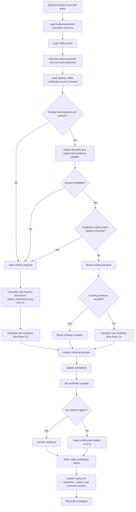
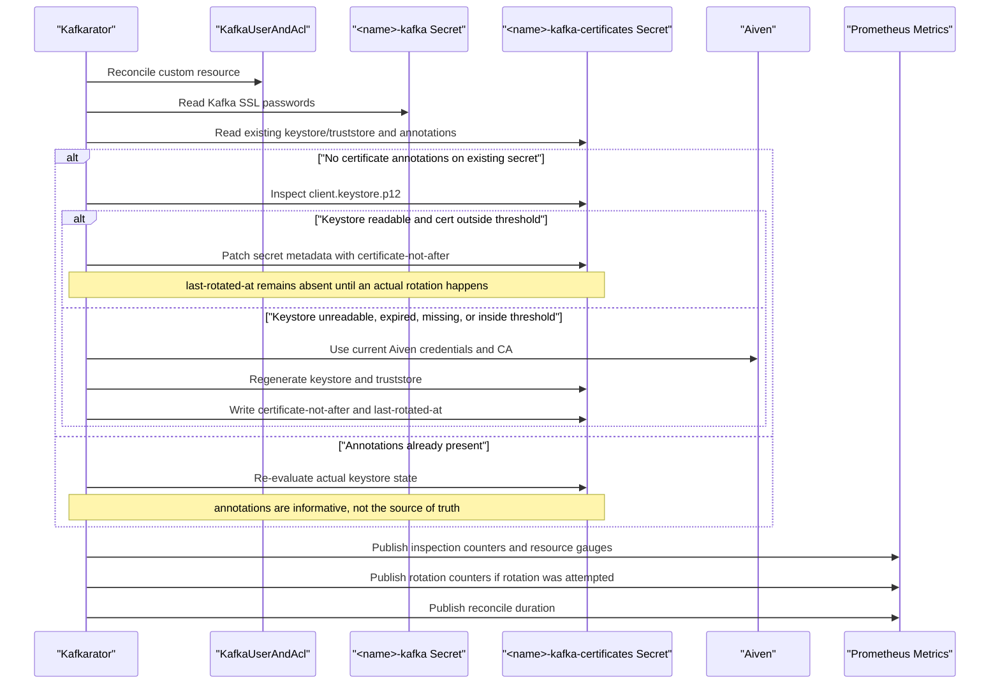
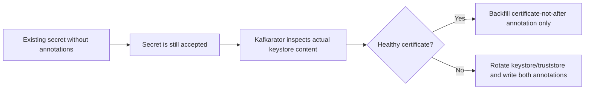

# Certificate Rotation Behavior

This document describes how Kafkarator handles existing certificate secrets, expiry-aware rotation, and metadata updates.

## Reconcile Decision Flow

## Existing Secret Adoption After Deploy

This diagram shows what happens after deploying the new Kafkarator version into a cluster with existing secrets that do not yet have the new annotations.

## Backward Compatibility Summary

## Notes

- The annotations are derived metadata, not required input.
- Missing annotations do not break reconcile.
- The actual keystore content remains the source of truth.
- A large number of old secrets may be patched shortly after rollout, either to backfill annotations or to rotate certificates that are already due.
